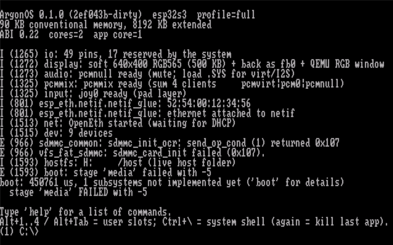
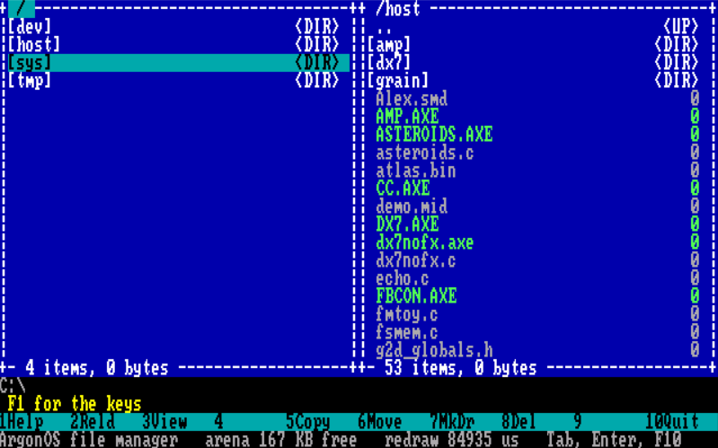
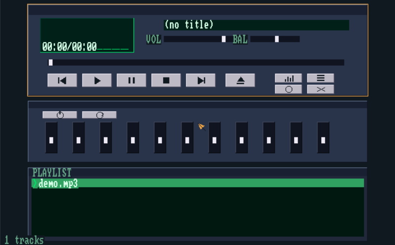
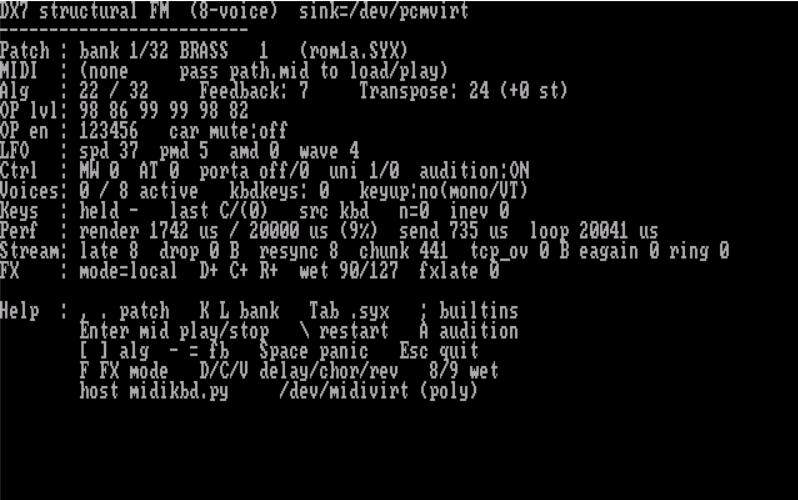

# ArgonOS

This operating system was written entirely using AI.

A small, fast operating system for ESP32-class microcontrollers.

ArgonOS follows the MS-DOS execution model — **the application owns the
machine** — while adding the few things that make a system usable in
industrial products: a stable ABI for third-party binaries, a real device and
driver model, per-process resource accounting, and a supervisor that can kill
a hung application without rebooting the board.

It is not a Linux clone. There is no MMU-backed process isolation, no virtual
memory, no POSIX emulation layer. There is a thin kernel, a syscall table, and
your code running on a dedicated CPU core with almost all of the RAM.

## Screenshots

<p align="center">
  
</p>

<p align="center">
  
</p>

<p align="center">
  
  &nbsp;
  
</p>

## Status

**Early development.** It boots, gives a prompt, mounts three drives, and runs
applications built with `tools/mkaxe.py` as processes: a task and a core of
their own, threads if they want them, an arena they allocate from, and full
accounting - a hung application can be stopped from the keyboard, one that
dereferences a null pointer is stopped by itself with the offset in its own code
written down, one that promises a heartbeat and stops sending it is ended by its
own watchdog, and every byte of any of them comes back. Crash records survive the
reboot on disk. Without an MMU a wild pointer can still corrupt memory that is
not the application's; that is a deliberate trade, not an oversight.

Devices have a model now: a registry with classes, owners and exclusive access,
reachable through the filesystem as `/dev` - so a device is a file, with the same
handle table, the same ownership and the same reclaim when a process dies. Behind
it are the card and the flash partition, sector by sector. Underneath that,
applications reach the hardware directly - pins, interrupts, I2C, SPI, UART, PWM
- with one rule: you may not take what something else is using, and everything
you took comes back when your process ends.

On the machine itself you can write programs in **Argon CC** — a small C-like
language with its own compiler (`CC.AXE`). It turns source into native
Xtensa `.AXE` applications or loadable `.SYS` drivers without a host toolchain:
edit on the board (or over HostFS), compile, `run` / `drv load`. Details and
the language subset are in [apps/cc/README.md](apps/cc/README.md).

The network is now something you can use rather than something the drivers
talk over: `net`, `wget`, `httpd` and `ftp` are commands of the system, so a
board whose card is empty can fetch what belongs on it. HTTP and FTP, name
resolution through `net->resolve` (ABI 0.33), and no TLS - an `https` URL is
refused by the URL parser rather than quietly fetched over port 80, because
mbedTLS wants tens of kilobytes this chip does not have. Verified end to end in
the emulator against servers on the development machine (`argon nettest`),
including 32 KB fetched into the guest and served back out of it byte for byte.
Details: [docs/10-network.md](docs/10-network.md).

What is still thin on real hardware is the panel/keyboard side; in QEMU soft
gfx, HostFS, OpenEth, and loadable `.SYS` modules already work. An
application's *code* that must live in the IRAM arena is size-capped; its data
and constants are not — they live in PSRAM and can run to megabytes. Larger
code can use flash XIP.

Start with **[docs/05-status.md](docs/05-status.md)**: what works, what does not,
how to build and verify, and the traps already found. Then
[docs/00-architecture.md](docs/00-architecture.md) for why the design is what it
is, and [docs/04-roadmap.md](docs/04-roadmap.md) for what comes next.

Writing an application? Host-side SDK path:
**[docs/sdk/01-getting-started.md](docs/sdk/01-getting-started.md)**
goes from an empty file to a running program; the rest of the contract is in
[02-api-reference.md](docs/sdk/02-api-reference.md),
[03-application-anatomy.md](docs/sdk/03-application-anatomy.md) and
[04-axe-format.md](docs/sdk/04-axe-format.md).
On the OS itself, use Argon CC as above. Using the machine rather than
programming it: [docs/user/01-shell.md](docs/user/01-shell.md),
[docs/user/02-board-setup.md](docs/user/02-board-setup.md),
[docs/user/03-host-share.md](docs/user/03-host-share.md) (QEMU folder sync) and
[docs/user/04-network.md](docs/user/04-network.md) (fetching and serving files).
The SDK docs are in
Russian, like the rest of the design notes.

No ESP32 board is required to work on this — see the note at the end of this
file.

## Design in one screen

```
  Applications (.AXE)   native code, loaded from SD, runs on a task of its own
  ─────────────────────────────────────────────────────────────────
  libargon              inline wrappers over a versioned syscall table
  ─────────────────────────────────────────────────────────────────
  ArgonOS kernel        loader · processes · memory arenas · VFS
                        console multiplexer · device manager · shell
                        supervisor (watchdog, Ctrl-Alt-Del, recovery)
  ─────────────────────────────────────────────────────────────────
  board pack            BOARD.CFG: pins, buses, display, SD mode
  ─────────────────────────────────────────────────────────────────
  ESP-IDF               FreeRTOS · drivers · Wi-Fi · USB · lwIP
```

* **Applications** are relocatable native images in two parts: code into the
  executable arena in internal SRAM, constants and data into PSRAM. No
  interpreter, no JIT, no sandbox — native speed after load. A font or a bitmap
  costs PSRAM, not arena: measured at 212 bytes of arena for an application whose
  96 KB font would otherwise not have fit at all.
* **A file manager** is part of the system, not a program to copy onto the board
  first: type `fm`. Two panels, the ten function keys everyone already knows, and
  it starts other programs and gets the screen back afterwards. The same source
  also builds as a loadable `.AXE`, which is how the built-in and the loaded path
  are kept honest - both go through the one syscall table.
* **The console** is a virtual text screen rendered simultaneously to UART,
  telnet and a local display, so the same build works headless or with a
  screen and a USB keyboard.
* **Graphics** are opt-in: text by default, an application can take the
  display and draw, exactly like a DOS video mode switch.
* **Drivers** are either linked in or loaded from `.SYS` modules at runtime.
* **Argon CC** is an on-device compiler for a C subset: build `.AXE` apps and
  `.SYS` drivers inside the OS (`CC.AXE`), no host GCC required for that path.

## Target hardware

Primary: **ESP32-S3** with 8 or 16 MB PSRAM and 8 MB flash. A 32 MB PSRAM
module does not work — the S3 maps flash and PSRAM through one 32 MB window,
and at 32 MB the partition table stops being visible; see the traps section of
[docs/05-status.md](docs/05-status.md).
Planned: ESP32-P4. Reduced profiles for ESP32 / C3 / C6.

## Building and running

Requires ESP-IDF 5.5 or newer. Everything goes through one entry point:

```
argon build              build the firmware
argon run                run in QEMU, console attached to this window
argon run -tcp           run in QEMU, console on 127.0.0.1:5556
argon test ver mem       boot in QEMU, type commands, print the screen
argon test -Put "build\HELLO.AXE=t:\hello.axe" "run t:\hello.axe"
                         the same, with a file copied into the guest first
argon tests              host unit tests, no hardware needed
argon apps               build every .AXE / .SYS in tools/apps.json
argon check              all of the above: tests, firmware, applications
argon flash -port COM5   flash a real board and open the monitor
```

`argon` is a batch file rather than a PowerShell script so that it works on a
stock Windows install, where running `.ps1` files is disabled by default.

An application is built by the SDK's image tool rather than by the firmware
build, because it is a separate binary with its own link layout:

```
python tools/mkaxe.py --arch xtensa --gcc xtensa-esp32s3-elf-gcc \
    --include sdk/include -o HELLO.AXE apps/hello/hello.c
```

Every application in the tree is listed in `tools/apps.json` and built by
`argon apps`, which `argon check` and CI run — a separate link is a separate
thing to break, and a green firmware build says nothing about it.

Machine specific paths (where ESP-IDF and a host compiler live) go in
`tools\local-env.ps1`, which is not committed; `tools\idf-env.ps1` guesses the
usual locations when it is absent.

No board is required to work on this: ArgonOS boots in Espressif's QEMU, and
`argon test` drives its console and prints the resulting screen. Everything
that has no dependency on the chip - path handling, the config parser, the text
screen, the terminal codecs, line editing, the VFS and the RAM disk - also
builds and runs on the host.

## License

Split licensing — details in [LICENSING.md](LICENSING.md):

- **Kernel** (`components/argon_kernel/`, `main/`) and host-tests: **GPL-3.0-or-later** ([LICENSE](LICENSE))
- **SDK** (`sdk/`), tools, and most apps: **Apache-2.0** ([LICENSE.Apache-2.0](LICENSE.Apache-2.0))
- Third-party trees keep their own licenses

Applications that only use the public syscall ABI are not required to be GPL.
Set the GitHub repository license to **GPL-3.0**.
