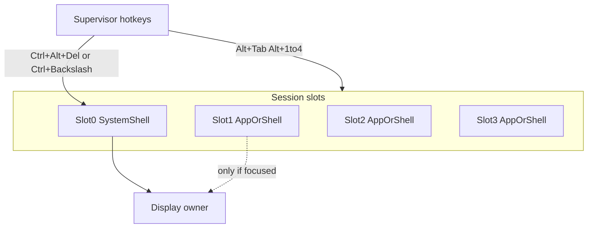

# План: системный шелл, слоты сессий и Alt-Tab

Статус: **реализовано (A+B+C)** — session slots, system-shell break-in, focus API.
Опирается на supervisor ([`docs/00-architecture.md`](../00-architecture.md) §5).

## P0 — было: break-in не срабатывал (исправлено)

**Было (2026-08-12):** при hung gfx + HostFS `Ctrl+\` выглядел мёртвым: kill
возвращал `-AG_EBUSY` без печати в консоль, а shell был заблокирован в `run`.

**Сделано:** VFS не держит лок на HostFS RPC; HostFS прерывается по
`ag_proc_stopping`; `Ctrl+\` → slot 0 без kill (повтор → kill) с текстом в
консоли; `run` больше не ждёт forever.

## Что уже есть (не путать с WM)

| Действие | Сегодня |
|----------|---------|
| Мягкий стоп | `Ctrl+C` → `ag_interrupted` + `AG_EV_QUIT` (приложение должно проверить) |
| Жёсткий стоп | `Ctrl+\` (терминал/QEMU) или `Ctrl+Alt+Del` (когда будет USB HID) |
| Возврат в шелл | Shell ждал foreground `run` → процесс снят → gfx release → снова промпт |
| Фоновые процессы | `run /b`, `ps`, `kill`, `fg` — **без** своих «окон» gfx |

Важно: break-in сейчас = **снять foreground и вернуть тот же shell**, а не
открыть отдельное системное окно поверх живого приложения. В QEMU `Ctrl+C`
часто съедает хост (`tools/qemu-common.ps1`); для гостя использовать **`Ctrl+\`**
в окне консоли (не SDL-видео).

## Цель (как видит пользователь)

1. Горячая клавиша всегда даёт доступ к **системному шеллу**, даже если gfx-приложение зависло.
2. Несколько **слотов/окон**: в каждом может быть своё gfx-приложение.
3. Перелистывание слотов (`Alt+Tab` / `Alt+1..4`).
4. Неактивный слот: графика не на экране; приложение **знает**, что не в фокусе, и **не рендерит** (снимает нагрузку с CPU).
5. Один слот — **системный**: только команды ОС, из него нельзя `run` gfx «в себя», только управлять остальными (`ps` / `kill` / `fg`).

### Как приложение узнаёт про фокус

- События **`AG_EV_FOCUS_LOST` / `AG_EV_FOCUS_GAINED`** через `ag_inp_poll` (сейчас в ABI есть, доставка будет).
- Запрос **`ag_focused()`** в SDK — можно проверять в цикле без ожидания события.
- **Контракт:** вне фокуса не звать `flush`/`swap`/тяжёлый redraw; спать/`yield` до `FOCUS_GAINED`.
- Ядро дополнительно игнорирует `flush` без focus (safety net); правильные apps останавливаются сами.

## Предлагаемая модель

- **Slot 0 — System**: всегда жив, владеет «аварийным» вводом; текст/консоль.
- **Slot 1..N — User**: `run` привязывает процесс к слоту; gfx acquire только у **focused** слота.
- Переключение фокуса:
  - снимает gfx у предыдущего (`release` или freeze backbuffer);
  - шлёт `AG_EV_FOCUS_LOST` / `AG_EV_FOCUS_GAINED` (уже есть в ABI, не используются);
  - отдаёт клавиатуру новому владельцу.
- Зависший app в слоте 2: `Ctrl+\` / `Ctrl+Alt+Del` → фокус на System (slot 0), app **не обязательно** убивать сразу; из system: `kill`, `fg`, `slots`.

## Фазы

### Фаза A — надёжный break-in (**P0, первым**)

1. **P0:** воспроизвести и починить отсутствие реакции на `Ctrl+\` при зависшем gfx app (см. блок «Приоритет P0» выше) — без этого остальное бессмысленно.
2. Документировать QEMU: куда именно слать клавиши ОС при `-Gfx`; стоп = `Ctrl+\` (и запасной хоткей, если терминал его ест).
3. Опционально: хоткей «только в system shell» без kill (новый режим), kill — отдельной командой или повторным хоткеем.
4. Починить путь soft-stop в QEMU (не отдавать `Ctrl+C` хосту **или** дублировать soft на другую клавишу, напр. `Ctrl+Break` / `F12`).
5. Пока app в длинном HostFS `read`: hard-kill с supervisor; проверить, что gfx+HostFS не даёт `-AG_EBUSY` без видимой обратной связи.

### Фаза B — слоты без полноценного WM (средне)

1. N слотов (сначала 4, как в arch `Alt+1..4`).
2. `Alt+1..4` переключает foreground/slot; System = `Alt+`` ` или всегда `Ctrl+\` → slot 0.
3. Gfx: acquire привязан к slot; при lost focus — принудительный `release` + `FOCUS_LOST` / `ag_focused()==false`; app останавливает рендер (контракт SDK + примеры GRAIN/AMP).
4. Shell в slot 0: команды `slots`, `kill`, `fg <slot|pid>`; запрет запускать NEEDS_GFX в slot 0 (или запускать только в свободный user slot).

### Фаза C — Alt-Tab UX (позже)

1. `Alt+Tab` цикл по живым слотам (с кратким text/gfx overlay списка).
2. Сохранение «замороженного» кадра слота (опционально) для превью.
3. Политика CPU: background slot — throttle / не звать `flush` (ядро может игнорировать flush без focus).

## Не в скоупе этого плана

- Настоящий desktop WM с перекрывающимися окнами и drag titlebar.
- Совместимость со скинами Winamp `.wsz`.
- Вытеснение произвольного кода без MMU (дикий write в ядро всё ещё возможен).

## Критерии готовности

- Зависший gfx app (в т.ч. AMP на медленном HostFS): одна документированная клавиша → виден system shell за &lt;1 s.
- Из system shell можно `ps` / `kill` / вернуться в app slot.
- `Alt+1..4` (фаза B): переключение без перезапуска; background не вызывает заметного gfx flush.
- SDK: приложения обрабатывают focus lost (AMP/GRAIN как образцы).
